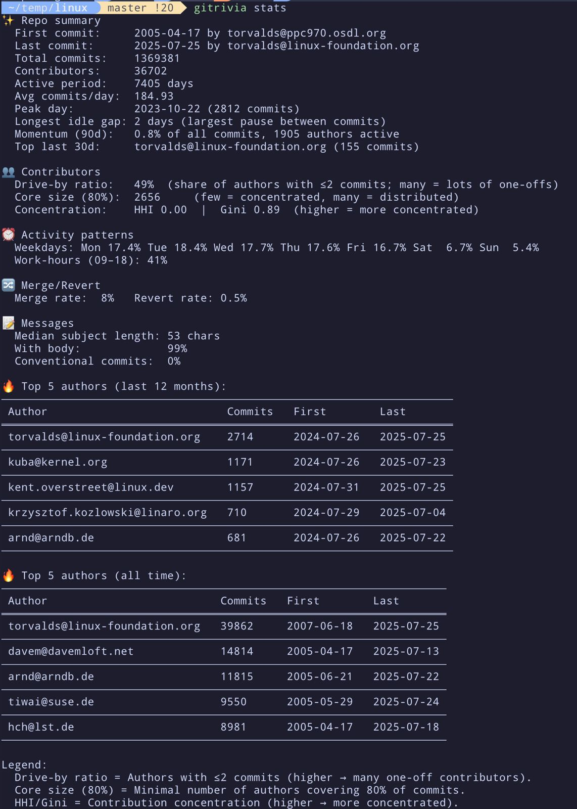

# 🧠 gitrivia

 

A fast Rust CLI to explore **who did what, when, and how much** in any Git repo.
Great for engineers, tech leads, and curious code archaeologists 🧬.

> Built for **large repos** (Linux‑kernel scale): one revwalk, minimal allocations,
> optional parallel blame, and fast heuristics when you need them.

---

## 🚀 Install

```bash
cargo build --release
cp target/release/gitrivia /usr/local/bin/gitrivia   # or anywhere on your PATH
```

---

## ⚙️ Global flags

Place **before** the subcommand; apply to every command.

* `--json` → machine‑readable output (scripts/dashboards/LLMs)
* `--desc` → descending sort where applicable (e.g., author lists)

Examples:

```bash
gitrivia --json stats
gitrivia --desc top-authors --since 2025-01-01
```

---

## 🧭 Which command should I run?

> Start with a question, follow the arrow, run the command.

* **I want a quick *health snapshot* of the repo.**

  * → `gitrivia stats`
* **Who’s most active *right now* (this quarter, etc.)?**

  * → `gitrivia top-authors --since YYYY-MM-DD`
* **Show activity range for a *single author*.**

  * → `gitrivia author-activity --author EMAIL`
* **Who *owns* this file’s lines of code?**

  * → `gitrivia blame-summary --file PATH`
* **Which files are touched by which authors (heatmap)?**

  * → `gitrivia file-contributions`
* **When do people commit (night owls vs office hours)?**

  * → `gitrivia commit-times`
* **Who started contributing when (first commit per author)?**

  * → `gitrivia first-commits`
* **Who tends to work together (shared files)?**

  * → `gitrivia top-coauthors`
* **Where’s the *ownership risk* (single‑author dominance)?**

  * Accuracy (line ownership, slower):

    * Files → `gitrivia bus-factor --threshold 0.75`
    * Dirs  → `gitrivia bus-factor --by dir --depth 2 --threshold 0.75`
  * Speed (recent touches, heuristic):

    * Files → `gitrivia bus-factor --fast --max-commits 5000 --threshold 0.7`
    * Dirs  → `gitrivia bus-factor --by dir --fast --depth 2 --max-commits 5000 --threshold 0.7`
* **What are the *hotspots* lately (volatile files/dirs)?**

  * Files → `gitrivia churn --window-days 90`
  * Dirs  → `gitrivia churn --by dir --depth 2 --window-days 90`

### 🍫 Quick cheat‑sheet

| Goal / Question                           | Command                                                | Tip                                   |
| ----------------------------------------- | ------------------------------------------------------ | ------------------------------------- |
| Snapshot repo health & Top‑5 contributors | `gitrivia stats`                                       | Add `--json` for dashboards           |
| Current period leaders                    | `gitrivia top-authors --since 2025-01-01 --desc`       | `--desc` sorts top first              |
| One author’s activity range               | `gitrivia author-activity --author alice@example.com`  | Exact email match                     |
| Who owns this file                        | `gitrivia blame-summary --file src/main.rs`            | Use before risky refactors            |
| File ↔ author heatmap                     | `gitrivia file-contributions`                          | Good for PR routing                   |
| Commit time distribution                  | `gitrivia commit-times`                                | Time‑zone coordination                |
| First commit per author                   | `gitrivia first-commits`                               | Find long‑term maintainers            |
| Frequent co‑workers (shared files)        | `gitrivia top-coauthors`                               | Pairing & knowledge transfer          |
| Bus factor (accurate, blame) — files/dirs | `gitrivia bus-factor [--by dir --depth 2]`             | Add `--threads N` for speed           |
| Bus factor (fast, touches) — files/dirs   | `gitrivia bus-factor --fast [--by dir --depth 2]`      | Tune `--max-commits` (recent history) |
| Recent hotspots (churn) — files/dirs      | `gitrivia churn [--by dir --depth 2] --window-days 60` | Larger window = smoother trends       |

---

## 📊 Commands

### 🔹 `stats` — high‑signal overview

**What:** Summarizes repo health + patterns and shows **Top‑5 contributors**.

**Why:** Due diligence, onboarding, health checks.

```bash
gitrivia stats
# add --json for dashboards
```

**Example (human):**

```text
✨ Repo summary
  First commit:     2013-03-18 by alice@alice.com
  Last commit:      2025-01-21 by bob@bob.com
  Total commits:    4,545
  Contributors:     533
  Active period:    4,328 days
  Avg commits/day:  1.05
  Peak day:         2016-02-28 (37 commits)
  Longest idle gap: 41 days (largest pause between commits)
  Momentum (90d):   4.3% of all commits, 9 authors active
  Top last 30d:     john@doe.com (3 commits)

👥 Contributors
  Drive-by ratio:   62%
  Core size (80%):  14
  Concentration:    HHI 0.21  |  Gini 0.78

⏰ Activity patterns
  Weekdays: Mon 18% Tue 17% Wed 16% Thu 17% Fri 20% Sat 6% Sun 6%
  Work-hours (09–18): 72%

🔀 Merge/Revert
  Merge rate: 31%   Revert rate: 1.8%

📝 Messages
  Median subject length: 48 chars
  With body:             63%
  Conventional commits:  54%

🔥 Top 5 authors: (table)
```

**Tips**

* Use `--limit N` to scan only the newest commits.
* Top‑5 table is always **desc** by commits.

---

### 🔹 `top-authors` — who’s active since a date

**What:** Commit counts per author **since YYYY‑MM‑DD**.

**Why:** Quarterly/OKR reviews, current maintainers.

```bash
gitrivia top-authors --since 2025-01-01 --desc
```

---

### 🔹 `author-activity` — one author’s range

**What:** First + last commit dates and total count for an exact email.

**Why:** Validate ownership/tenure, find stale contributors.

```bash
gitrivia author-activity --author alice@example.com
```

---

### 🔸 `blame-summary` — line ownership for a file

**What:** Who owns how many lines (via `git blame`).

**Why:** Code owners, review routing, bus‑factor checks.

```bash
gitrivia blame-summary --file src/main.rs      # human
gitrivia blame-summary --file src/main.rs --json | jq
```

---

### 🔸 `file-contributions` — file ↔ author heatmap

**What:** Per file, how many commits each author made that changed it.

**Why:** Rough ownership/touch map; useful for refactors & PR routing.

```bash
gitrivia file-contributions [--json]
```

---

### 🔸 `commit-times` — when people commit

**What:** Buckets per author: `night` (00–05), `morning` (06–11), `afternoon` (12–17), `evening` (18–23).

**Why:** Coordination across time zones; after‑hours patterns.

```bash
gitrivia commit-times [--json]
```

---

### 🔸 `first-commits` — first commit per author

**What:** Oldest commit per author.

**Why:** Identify founding contributors / long‑term maintainers.

```bash
gitrivia first-commits [--json]
```

---

### 🔸 `top-coauthors` — frequent pairs

**What:** Contributor pairs that often modify the same files.

**Why:** Org maps, pairing opportunities, hidden silos.

```bash
gitrivia top-coauthors [--json]
```

---

### 🔸 `bus-factor` — risky ownership concentration (file/dir)

**What:** Flags files or directories dominated by a single author.

**Why:** Reduce risk; plan rotations, docs, or reviews.

**Modes**

* **Accurate (`blame`)**: line ownership (slower, parallelizable)
* **Fast (`--fast`)**: heuristic using **touch counts** from recent commits

**Directory aggregation** with `--by dir` and `--depth N`.

```bash
# Accurate (blame-based), files
gitrivia bus-factor --threshold 0.75

# Directory-level, accurate, depth=2
gitrivia bus-factor --by dir --depth 2 --threshold 0.7

# FAST heuristic (touches), last 5000 commits
gitrivia bus-factor --fast --max-commits 5000 --threshold 0.7
```

**Useful options**

* `--threshold 0.75`      : flag ownership ratio (default 0.75)
* `--by file|dir` `--depth N` : aggregate to directories
* `--threads N`           : parallel blame (accurate mode)
* `--all` / `--include-ext lua,vim` : file filtering
* `--min-total 25`        : skip tiny files (lines or touches)
* `--limit 20`            : rows to print (human output)

---

### 🔸 `churn` — recent volatility (file/dir)

**What:** Ranks files (or directories) by **weighted recent change**.
For each commit in the window (default **90 days**): compute `adds + dels`,
weight by linear decay (newer changes count more), then sum per path.

**Why:** Find hotspots, refactor targets, and risky entry points.

```bash
# Top volatile files in last 90 days
gitrivia churn --window-days 90

# Aggregate to directories (depth 2)
gitrivia churn --by dir --depth 2 --window-days 60
```

**Columns**

* `Churn`  : weighted (adds+dels)
* `Adds`   : added lines
* `Dels`   : deleted lines
* `Touches`: commits that touched this path in the window

**Filters**

* `--all` or `--include-ext lua,vim`
* `--min-total 1` to skip near‑empty paths
* `--limit 20` rows

**Interpretation**

* High `Churn` + high `Touches` → unstable hotspot; expect bugs/rework.
* High `Churn` + low `Touches` → big rewrites; verify test coverage & reviews.

---

## 🧪 Examples (copy/paste)

```bash
# Repo snapshot
gitrivia stats

# Current period leaders
gitrivia --desc top-authors --since 2025-01-01

# File ownership
gitrivia blame-summary --file src/main.rs

# Risky directories (accurate)
gitrivia bus-factor --by dir --depth 2 --threshold 0.7 --threads 8

# Fast triage (touches only)
gitrivia bus-factor --fast --max-commits 10000 --threshold 0.65

# Hotspots in last 60 days
gitrivia churn --window-days 60 --limit 30

# JSON for dashboards
gitrivia --json stats | jq
gitrivia churn --by dir --json | jq
```

---

## ✨ JSON everywhere

Every command accepts `--json` so you can feed dashboards and scripts:

```bash
gitrivia top-coauthors --json | jq
```

---

## 📦 Roadmap

* Global `--since` / `--until` on all commands
* TUI dashboard
* Per‑author “streaks”
* PR‑level stats (merge latency, review load)
* Ownership diffs over time

---

## 🧮 Metric cheat‑sheet

* **Drive‑by ratio** — % of authors with ≤2 commits (higher → many one‑offs).
* **Core size (80%)** — minimal #authors to cover 80% of commits.
* **HHI / Gini** — contribution concentration (higher → dominated by few).
* **Longest idle gap** — largest pause between two commits (days).
* **Momentum (90d)** — % of lifetime commits in last 90 days.
* **Work‑hours %** — share of commits 09:00–17:59 (local).
* **Churn** — weighted (adds+dels) over a time window (newer changes weigh more).
* **Bus‑factor** — top owner’s share (lines via blame, or touches in FAST mode).

---

## 🦀 Built with

* [git2](https://crates.io/crates/git2)
* [chrono](https://crates.io/crates/chrono)
* [serde](https://crates.io/crates/serde)
* Rust. Obviously.

PRs welcome. Or don’t. I’m not your boss. 😎

